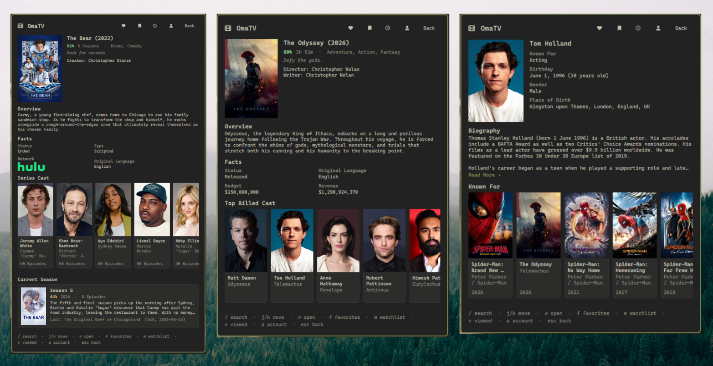

# OmaTV

Search Movies, TV shows and People on [TMDB](https://www.themoviedb.org/) from the
Omarchy bar, with your account's Favorites and Watchlist and a local history of
what you last looked at.



## Features

- **Search** movies, TV shows and people in one query, filterable by type
- **Movie details** — score, runtime, genres, tagline, overview, director and
  writers, plus Status / Original Language / Budget / Revenue
- **TV details** — score, seasons, creators, overview, Status / Type / Network
  (as the network's logo) / Original Language, and a Current Season card with the
  next or last episode to air
- **People** — biography, birthday with age, gender, place of birth, and the
  eight titles they are best known for
- **Everything is cross-linked**: tap an actor to open their page, tap one of
  their credits to open that movie or show, and Escape walks back the way you came
- **Favorites and Watchlist** from your TMDB account, split by Movies and TV
- **History** of the last 10 items you opened, kept across restarts
- Cached on disk and **refreshed only when you ask**, so the plugin stays well
  clear of TMDB's rate limit

## Requirements

- Omarchy with the Quickshell bar (`omarchy-shell`)
- `curl`
- A TMDB API key (free — see Setup)
- A Nerd Font in the bar for the icons

## Install

```bash
omarchy plugin add https://github.com/MarcusPelo/omatv.git
omarchy plugin enable marcuspelo.omatv
```

## Setup

Create `~/.config/omatv/.env`:

```bash
mkdir -p ~/.config/omatv
printf 'API_KEY=your_tmdb_key_here\n' > ~/.config/omatv/.env
chmod 600 ~/.config/omatv/.env
```

Get the key from **TMDB → Settings → API**. Either credential works:

| Credential | Where TMDB calls it | Notes |
|---|---|---|
| API Read Access Token (v4) | "API Read Access Token" | **Preferred** — sent as an `Authorization` header, so it never touches a URL |
| API Key (v3) | "API Key" | Works too, but TMDB only accepts it as a query parameter |

OmaTV detects which one you pasted and picks the matching auth method.

Optional keys:

| Key | Meaning |
|---|---|
| `LANGUAGE` | Fallback language tag, e.g. `pt-BR`. The widget setting wins if set. |

### Connecting your account (optional)

Favorites and Watchlist are private, so they need a TMDB session. Open the panel,
press `a`, click **Connect TMDB**, approve OmaTV in the browser tab that opens,
then click **Continue**.

TMDB sessions do not expire, so this is a one-time step. The session id is stored
in `~/.config/omatv/session.json` (mode 0600). **Disconnect** invalidates it on
TMDB's side as well as deleting it locally.

Search and the detail screens work fine without connecting.

## Configuration

```bash
omarchy bar set marcuspelo.omatv language pt-BR
```

| Setting | Type | Default | Meaning |
|---|---|---|---|
| `language` | string | `en-US` | Language for titles, overviews and biographies |

## Keyboard shortcuts

The panel opens with shortcuts live, so navigation keys work immediately. Press
`/` when you want to type a query.

| Key | Action |
|---|---|
| `/` | Focus the search field |
| `j` / `k` or `Down` / `Up` | Move the selection through the list |
| `Enter` | Open the selected entry |
| `f` | Favorites |
| `w` | Watchlist |
| `v` | Recently viewed (history) |
| `a` | Account |
| `r` | Refresh the current list (Favorites / Watchlist), or re-run the search |
| `Tab` | Move to the neighbouring bar panel |
| `Esc` | Leave the search field, then go back a screen, then close |

While the search field has focus, letters go into the query rather than acting as
shortcuts; `Escape` leaves the field. Changing screen always returns focus to the
panel, so the shortcuts cannot get stuck.

History is bound to `v` rather than the more obvious `h` because Omarchy's
`PanelKeyCatcher` reserves `h`, `j`, `k`, `l` and `x` for list movement before a
plugin ever sees them.

## Rate limiting

Search and detail screens are fetched on demand and memoised for the session.
Account lists are different: they are **never** polled. They load from
`~/.cache/omatv/account.json` and only hit TMDB when you press **Refresh** or `r`,
and the panel shows how long ago that was. One refresh costs four requests, one
per list, issued sequentially rather than in a burst.

## Security

- The API key lives in `~/.config/omatv/.env`, outside the plugin directory, and
  the plugin re-applies mode `0600` every time it reads it.
- Credentials are handed to `curl` as a **config file on stdin** (`curl -K -`),
  never as command-line arguments — so they cannot be recovered from `ps`,
  `/proc/<pid>/cmdline`, or process-inspection tooling.
- With a v4 read token the credential is sent as an `Authorization` header and
  never appears in a URL at all. A v3 key has to travel as a query parameter
  because TMDB offers no header form for it; stdin still keeps it out of the
  process table.
- The session id gets the same treatment: stdin only, `0600` on disk.
- The browser is only ever sent the TMDB approval URL, which carries the
  short-lived request token — never the API key or the session id.
- `.env` and `session.json` are gitignored and are never written inside the
  plugin directory.
- Poster and profile images come from TMDB's public image CDN and need no
  credential, so they are loaded directly with no proxying.

## Remove

```bash
omarchy plugin disable marcuspelo.omatv
omarchy plugin remove marcuspelo.omatv
rm -rf ~/.config/omatv ~/.cache/omatv
```

## License

MIT — see [LICENSE](LICENSE).
